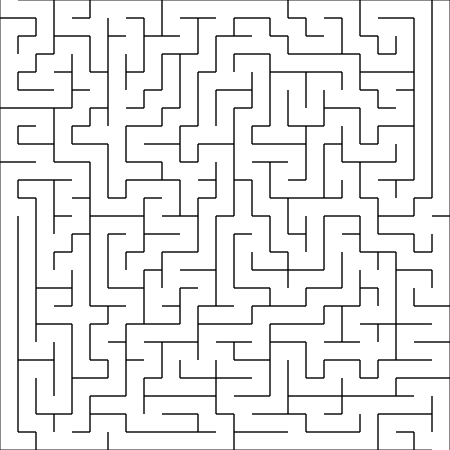

# 🧩 Gerador de Labirintos em Python (SVG)

Este é um projeto simples e eficiente em Python para gerar labirintos aleatórios "perfeitos" utilizando o algoritmo de **Busca em Profundidade (DFS - Depth-First Search)** com retrocesso (*backtracking*). O resultado final é renderizado diretamente em um arquivo vetorial **SVG** de alta qualidade.

O labirinto gerado é garantido como sendo "perfeito", o que significa que:
1. Não existem caminhos fechados (loops).
2. Existe exatamente um único caminho válido entre qualquer par de células.
3. Possui uma **entrada** aberta no topo esquerdo e uma **saída** aberta no canto inferior direito.

---

## 🎨 Exemplo de Saída

O script gera um arquivo SVG como este:



---

## ⚡ Tecnologias e Ferramentas

*   **Linguagem:** [Python](https://www.python.org/) (>= 3.11)
*   **Biblioteca de Renderização:** [svgwrite](https://github.com/mozman/svgwrite) (para criar o arquivo vetorial `.svg`)
*   **Gerenciador de Pacotes:** [uv](https://github.com/astral-sh/uv) (rápido e moderno instalador e gerenciador para Python)

---

## ⚙️ Como Funciona o Algoritmo

1.  **Grade Inicial:** É criada uma matriz representando a grade, onde cada célula começa isolada com quatro paredes (Norte, Sul, Leste e Oeste).
2.  **Busca em Profundidade (DFS):**
    *   O algoritmo escolhe uma célula inicial (neste caso, a `(0,0)`).
    *   Marca-a como visitada.
    *   Embaralha de forma aleatória a ordem das direções a serem exploradas (Norte, Sul, Leste, Oeste).
    *   Para cada célula vizinha não visitada na lista embaralhada, ele remove a parede que as separa e chama a si mesmo recursivamente para continuar a exploração.
    *   Caso não haja vizinhos não visitados, o algoritmo volta (*backtrack*) pelas células anteriores até encontrar uma que possua vizinhos disponíveis.
3.  **Entrada e Saída:**
    *   A parede superior da célula no topo esquerdo `(0,0)` é removida para criar a **entrada**.
    *   A parede inferior da célula no canto inferior direito `(width - 1, height - 1)` é removida para criar a **saída**.
4.  **Desenho no SVG:** O script itera sobre cada célula e desenha linhas pretas para cada parede que continua de pé.

---

## 🚀 Como Executar o Projeto

Existem duas formas principais de rodar o projeto em sua máquina:

### Opção 1: Usando `uv` (Recomendado - Super Rápido)

Se você já possui o gerenciador de pacotes `uv` instalado:

1.  Abra o terminal na raiz do projeto.
2.  Execute o script diretamente (o `uv` irá resolver e rodar com as dependências do `pyproject.toml`):
    ```bash
    uv run main.py
    ```

### Opção 2: Usando o Python padrão e `venv`

1.  Crie um ambiente virtual:
    ```bash
    python -m venv .venv
    ```
2.  Ative o ambiente virtual:
    *   **Windows (PowerShell):** `.venv\Scripts\Activate.ps1`
    *   **Windows (CMD):** `.venv\Scripts\activate.bat`
    *   **Linux/macOS:** `source .venv/bin/activate`
3.  Instale as dependências:
    ```bash
    pip install -r requirements.txt
    # Ou instale via pyproject:
    pip install .
    ```
4.  Execute o script:
    ```bash
    python main.py
    ```

Após a execução, um arquivo chamado `labirinto.svg` será criado ou atualizado no diretório do projeto.

---

## 🛠️ Customização

Você pode facilmente alterar o tamanho e a resolução do labirinto abrindo o arquivo [main.py](main.py) e ajustando os **Parâmetros** no início do arquivo:

```python
# Parâmetros
width = 25       # Largura do labirinto em número de células
height = 25      # Altura do labirinto em número de células
cell_size = 20   # Tamanho (em pixels) de cada célula no SVG
```

*   Aumentar `width` e `height` tornará o labirinto mais complexo e difícil de resolver.
*   Ajustar `cell_size` permite controlar o tamanho físico/escala do labirinto gerado no arquivo final.

---

## 📝 Licença

Este projeto é de uso livre para fins didáticos e recreativos. Fique à vontade para clonar, modificar e expandir!
